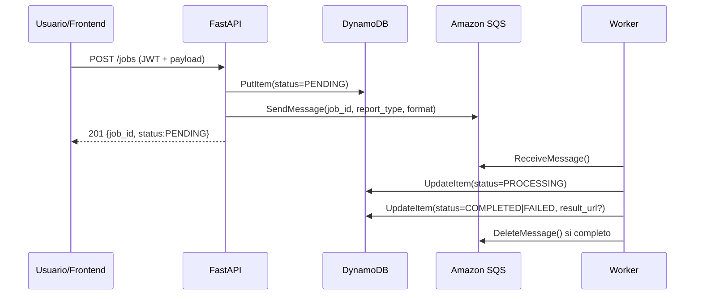

# SKILL - Manual Operativo Completo del Proyecto Prosperas

Estado: Activo para Fase 5 y trabajo de agentes con contexto unico.

## 1. Proposito de Este Archivo

Este archivo esta disenado para que un agente de IA o un desarrollador nuevo pueda entender el proyecto Prosperas sin abrir el resto del repositorio.

Objetivo principal:
- describir el sistema real, no un plan abstracto
- permitir responder preguntas tecnicas usando solo este archivo
- servir como contexto autosuficiente para trabajo operativo y mantenimiento

Este archivo debe responder con precision, usando el estado real del proyecto al 2026-03-22.

## 2. Resumen Ejecutivo del Sistema

Prosperas es un sistema de procesamiento asincrono de reportes.

Problema que resuelve:
- un usuario necesita solicitar un reporte sin esperar a que termine el procesamiento
- el backend debe responder rapido, delegar el trabajo a una cola y permitir consultar el estado despues
- el frontend debe mostrar el avance del job sin recargar toda la pagina

Que hace el sistema hoy:
- autentica un usuario demo con JWT
- recibe solicitudes de reportes por API
- crea un job con estado inicial `PENDING`
- persiste el job en DynamoDB
- publica el trabajo en Amazon SQS
- un worker concurrente consume mensajes y procesa en segundo plano
- el worker aplica circuit breaker por `report_type` cuando detecta fallos consecutivos
- el worker actualiza el estado del job a `PROCESSING`, `COMPLETED` o `FAILED`
- el frontend React consulta el backend cada 5 segundos y actualiza los badges visuales

Estado real actual:
- backend desplegado en AWS EC2 y accesible en `http://18.212.132.182:8000`
- healthcheck productivo verde en `http://18.212.132.182:8000/health`
- frontend implementado y validado en local, pero aun no desplegado en produccion
- la generacion del resultado del reporte sigue siendo simulada: `result_url` apunta a `s3://prosperas-reports/<job_id>.<format>`

## 3. Opciones de Arquitectura Evaluadas al Inicio y Decision Final

### Opcion A - Serverless AWS Nativo

Arquitectura posible:
- API Gateway para exponer endpoints
- AWS Lambda para login, creacion de jobs y procesamiento
- Amazon SQS para desacoplamiento
- DynamoDB para persistencia
- S3 + CloudFront para frontend y artefactos

Ventajas:
- muy alineada al ecosistema AWS nativo
- menos servidores que administrar
- escalado elastico por demanda

Desventajas para este reto:
- mas piezas de infraestructura para explicar en pocos dias
- mas friccion para depurar localmente sin desviarse del tiempo del reto
- mayor riesgo de complejidad operativa y costo si se expande con servicios adicionales
- cold starts y mas complejidad operativa para el plazo del reto

### Opcion B - Arquitectura Event-Driven Contenerizada sobre EC2

Arquitectura elegida:
- FastAPI en contenedor para exponer la API
- worker Python en contenedor para consumir SQS
- Amazon SQS para desacoplar API y procesamiento
- DynamoDB para persistencia de jobs
- React + Vite para frontend
- LocalStack para emular AWS en local
- GitHub Actions + ECR + SSM + EC2 para CI/CD y despliegue

Ventajas:
- mas simple de construir en 5 dias
- mas facil de depurar que Lambda o ECS/Fargate
- compatible con un entorno local muy parecido a produccion usando Docker Compose + LocalStack
- menor riesgo de costo para el objetivo de USD 0-10
- permite explicar claramente el desacoplamiento, la concurrencia y la resiliencia

### Por que se eligio la Opcion B

Se eligio la arquitectura sobre EC2 porque:
- minimiza el riesgo de entrega en el tiempo disponible
- facilita un flujo local estable con LocalStack
- evita la deriva de costo y complejidad de Fargate o topologias con mas componentes administrados
- permite operar API y worker con el mismo codigo Python y la misma imagen Docker del backend

## 4. Tecnologias Usadas y Por Que

| Tecnologia | Uso real en el proyecto | Por que se eligio |
| --- | --- | --- |
| Python 3 | lenguaje principal de backend y worker | rapidez de implementacion, ecosistema fuerte para APIs y AWS |
| FastAPI | API HTTP | tipado con Pydantic, rapidez y contratos claros |
| Pydantic v2 | validacion de request/response | contratos claros y validacion declarativa |
| python-jose | JWT | implementacion simple de autenticacion demo |
| boto3 | acceso a DynamoDB y SQS | SDK oficial AWS |
| React 19 | frontend | interfaz moderna para login, creacion y seguimiento de jobs |
| Vite | bundler frontend | desarrollo rapido y build simple |
| Docker | empaquetado y runtime local/prod | coherencia entre entornos |
| Docker Compose | orquestacion local y en EC2 | levanta multiples servicios sin Kubernetes |
| LocalStack | emulacion local de AWS | permite probar SQS y DynamoDB sin tocar AWS real |
| DynamoDB | persistencia del estado del job | simple, barata y suficiente para este patron |
| Amazon SQS | cola principal, prioridad y DLQ | desacoplamiento, retry y DLQ nativos |
| Amazon ECR | registro de imagenes | integracion directa con GitHub Actions |
| Amazon EC2 | ejecucion productiva | menor riesgo operativo que ECS/Fargate |
| AWS SSM | despliegue remoto en EC2 | evita SSH manual y permite deploy idempotente |
| Terraform | infraestructura AWS | IaC reproducible para EC2, ECR, SQS, DynamoDB, IAM |
| GitHub Actions | CI/CD | pipeline simple, auditable y suficiente para el reto |

### 4.1 Tecnologias Alternativas No Elegidas y Motivo

| Componente | Tecnologia implementada | Otras opciones viables | Por que no se eligieron en este proyecto |
| --- | --- | --- | --- |
| Backend API | FastAPI (Python) | Django REST Framework, Flask, NestJS (Node) | FastAPI permitio mayor velocidad de implementacion con tipado fuerte y menos boilerplate para el tiempo del reto |
| Worker de procesamiento | Worker Python en el mismo repositorio | Celery con Redis/RabbitMQ, workers Node.js | Se priorizo simplicidad operativa y reutilizacion del mismo modelo de dominio y servicios de backend |
| Mensajeria | Amazon SQS (main + priority + DLQ) | RabbitMQ autogestionado, Apache Kafka, Redis Streams | SQS reduce carga operativa, integra DLQ nativa y encaja mejor con costo/tiempo del proyecto |
| Persistencia de estado | DynamoDB | PostgreSQL/RDS, MongoDB Atlas | DynamoDB resolvio bien el patron clave-valor + consulta por usuario sin administrar motor relacional |
| Runtime productivo | EC2 + Docker Compose | ECS Fargate, EKS/Kubernetes | EC2 fue mas rapido de poner en marcha y depurar; Fargate/EKS agregan complejidad para el alcance actual |
| Frontend build/runtime local | React + Vite | Next.js, Vue, Angular | Vite ofrecio menor friccion de build y ciclo de desarrollo mas directo para una SPA de dashboard |
| CI/CD | GitHub Actions + ECR + SSM | GitLab CI, Jenkins, AWS CodePipeline/CodeBuild | GitHub Actions ya estaba alineado con el repositorio y permitio automatizar deploy sin infraestructura adicional |
| IaC | Terraform | CloudFormation, AWS CDK | Terraform dio expresividad y velocidad para aprovisionar recursos AWS de forma declarativa y reproducible |

## 5. Estado Real del Proyecto

Implementado y validado:
- Fase 1: backend base, auth demo, endpoints core, LocalStack
- Fase 2: worker concurrente, estados, prioridad, backoff, DLQ
- Fase 3: frontend React dockerizado con polling y UX responsive
- Fase 4: despliegue productivo backend + worker en EC2 con CI/CD
- Fase 5: documentacion final y smoke test productivo verificado
- Fase 6: hardening tecnico con B2 (circuit breaker) y B6 (17 pruebas backend, 75 por ciento de cobertura)

En curso:
- no hay trabajo activo cerrado a medias en este momento

Pendiente:
- Fase 7: cierre final de bonus B3, despliegue frontend en produccion, defensa tecnica y paquete de entrega

Estado de bonus:
- Completados: B1 (prioridad), B2 (circuit breaker), B4 (backoff), B5 (observabilidad), B6 (cobertura >= 70%)
- Pendientes: B3 (tiempo real)

Importante:
- frontend NO esta desplegado en produccion aun; su despliegue corresponde a Fase 7 como parte del cierre final
- `POST /jobs` y el worker si estan operativos en produccion
- `result_url` es simulado; no hay generacion real de PDF/CSV ni descarga real desde S3
- observabilidad real actual = logs estructurados basicos + endpoint `/health`

## 6. Arquitectura y Flujo End-to-End

Flujo real del sistema:

1. El usuario se autentica con `POST /auth/login` usando credenciales demo.
2. La API devuelve un JWT bearer.
3. El frontend guarda el token en `localStorage`.
4. El usuario envia `POST /jobs` con `report_type`, `date_range` y `format`.
5. La API valida JWT y payload.
6. `JobService.create_job()` genera un `job_id` UUID.
7. La API persiste el job en DynamoDB con estado `PENDING`.
8. La API decide si el job va a cola principal o cola de prioridad.
9. La API publica el mensaje en SQS.
10. La API responde inmediatamente con `job_id` y `PENDING`.
11. El worker hace polling primero a la cola de prioridad y luego a la principal.
12. Al recibir mensaje, cambia el estado a `PROCESSING`.
13. Si el `report_type` empieza por `fail`, se fuerza un error de prueba.
14. Si no falla, simula el procesamiento por 3 segundos y marca `COMPLETED` con `result_url`.
15. Si falla y aun tiene intentos disponibles, revierte a `PENDING` y aplica backoff exponencial via `change_message_visibility`.
16. Si supera el maximo de intentos, marca `FAILED` y deja que SQS lo mueva a la DLQ por `RedrivePolicy`.
17. El frontend consulta `GET /jobs` y `GET /jobs/{job_id}` cada 5 segundos y refleja el estado sin recargar la pagina.

Estados canonicos del job:
- `PENDING`
- `PROCESSING`
- `COMPLETED`
- `FAILED`

Diagrama rapido de secuencia (API -> SQS -> Worker -> DynamoDB):



## 7. Servicios AWS Activos y Funcion Real

Servicios activos en AWS real:
- EC2: `i-085134f9bf4e85cd1`
- ECR: `635896495979.dkr.ecr.us-east-1.amazonaws.com/prosperas-backend`
- DynamoDB: tabla `prosperas-jobs` con GSI `user_id-index`
- SQS principal: `prosperas-jobs-queue`
- SQS prioridad: `prosperas-jobs-priority-queue`
- SQS DLQ: `prosperas-jobs-dlq`
- IAM role EC2: `prosperas-ec2-role`
- SSM: usado por GitHub Actions para ejecutar despliegue remoto

URLs reales de produccion:
- API: `http://18.212.132.182:8000`
- Healthcheck: `http://18.212.132.182:8000/health`

Respuesta real verificada del healthcheck:

```json
{
	"status": "ok",
	"service": "backend",
	"environment": "production",
	"dependencies": {
		"dynamodb": "ok",
		"sqs": "ok"
	}
}
```

## 8. Mapa Completo del Repositorio

### Raiz del proyecto

- `SSOT.md`: documento de gobierno y fases del proyecto
- `README.md`: resumen ejecutivo, estado real e infraestructura
- `TECHNICAL_DOCS.md`: documentacion tecnica complementaria
- `SKILL.md`: este manual autosuficiente
- `AI_WORKFLOW.md`: evidencia de uso de IA durante el proyecto
- `AGENTS.md`: reglas operativas para agentes

### Backend

Ruta base: `backend/app`

- `main.py`: crea la app FastAPI, configura CORS, registra routers y define `/` y `/health`
- `api/routes/auth.py`: `POST /auth/login`
- `api/routes/jobs.py`: `POST /jobs`, `GET /jobs`, `GET /jobs/{job_id}`
- `api/dependencies/auth.py`: obtiene el usuario desde el JWT bearer
- `core/config.py`: configuracion centralizada por variables de entorno
- `core/security.py`: crea y valida JWT
- `core/exceptions.py`: errores de negocio e infraestructura
- `core/error_handlers.py`: respuestas uniformes para errores
- `models/job.py`: modelo `Job` y enum `JobStatus`
- `models/auth.py`: `UserContext`
- `schemas/job.py`: contratos Pydantic para jobs
- `schemas/auth.py`: contratos de login y token
- `services/job_service.py`: orquesta DynamoDB + SQS para crear y consultar jobs
- `services/circuit_breaker.py`: controla apertura, enfriamiento y recuperacion del circuit breaker por tipo de reporte
- `services/dynamodb_service.py`: acceso a tabla y paginacion por cursor
- `services/sqs_service.py`: publicacion, lectura, borrado y cambio de visibilidad en SQS
- `services/user_service.py`: valida credenciales demo
- `services/service_factory.py`: proveedores de dependencias
- `worker/consumer.py`: worker concurrente con dos consumidores, prioridad, retry y DLQ

### Frontend

Ruta base: `frontend/src`

- `App.jsx`: raiz de la app, manejo de token y cambio login/dashboard
- `pages/DashboardPage.jsx`: polling cada 5s, resumen de estados, carga de mas jobs, logout
- `components/LoginCard.jsx`: login contra `POST /auth/login`
- `components/ReportComposer.jsx`: formulario para crear jobs
- `components/JobsBoard.jsx`: tabla/listado de jobs y refresco manual
- `components/StatusBadge.jsx`: badge visual por estado
- `components/ToastStack.jsx`: notificaciones de UI
- `services/api.js`: wrapper `fetch`, auth header y manejo de errores HTTP
- `styles/global.css`: estilos responsive y branding

### Local

- `local/docker-compose.yml`: levanta LocalStack, backend, worker y frontend
- `local/.env`: variables locales para LocalStack
- `local/init/ready.d/00-init-aws.sh`: crea tabla DynamoDB, cola principal, prioridad y DLQ en local
- `local/scripts/testing/phase1_runtime_validate.sh`: valida Fase 1
- `local/scripts/testing/phase2_runtime_validate.sh`: valida Fase 2
- `local/scripts/testing/phase3_runtime_validate.sh`: valida Fase 3

### Infraestructura y despliegue

- `infra/terraform/main.tf`: EC2, ECR, DynamoDB, SQS, IAM y permisos
- `infra/terraform/outputs.tf`: outputs de infraestructura
- `infra/ec2/docker-compose.prod.yml`: backend + worker en produccion
- `infra/ec2/deploy.sh`: instala runtime, login ECR, pull, up -d y healthcheck
- `.github/workflows/deploy.yml`: build a ECR y deploy remoto via SSM

### Documentacion tecnica visual

- `docs/diagrams/architecture/system-architecture.md`: diagrama de arquitectura
- `docs/diagrams/workflow/job-lifecycle.md`: secuencia del ciclo de vida del job
- `docs/diagrams/workflow/ci-cd-overview.md`: flujo de CI/CD
- `docs/ssot/CHANGELOG.md`: historial de decisiones y correcciones

## 9. Backend: Detalle de Implementacion

### 9.1 Autenticacion

La autenticacion es demo y usa JWT.

Flujo:
- el cliente envia `username` y `password` a `POST /auth/login`
- `validate_demo_credentials()` compara contra variables de entorno
- `create_access_token()` genera un JWT con `sub`, `iat` y `exp`
- las rutas protegidas usan `HTTPBearer` y decodifican el token

Credenciales demo por defecto:
- username: `demo`
- password: `demo123`

JWT por defecto:
- algoritmo: `HS256`
- expiracion: 60 minutos

### 9.2 Endpoints Reales

#### `POST /auth/login`

Request:

```json
{
	"username": "demo",
	"password": "demo123"
}
```

Response:

```json
{
	"access_token": "<jwt>",
	"token_type": "bearer"
}
```

#### `POST /jobs`

Protegido por bearer token.

Request:

```json
{
	"report_type": "ventas_diarias",
	"date_range": {
		"start_date": "2026-03-01",
		"end_date": "2026-03-10"
	},
	"format": "pdf"
}
```

Reglas:
- `report_type`: string entre 2 y 80 caracteres
- `format`: `pdf`, `csv` o `xlsx`
- `date_range.end_date` no puede ser menor que `start_date`

Response HTTP 201:

```json
{
	"job_id": "uuid",
	"status": "PENDING"
}
```

#### `GET /jobs/{job_id}`

Devuelve el estado actual del job del usuario autenticado.

#### `GET /jobs`

Lista jobs del usuario autenticado usando el GSI `user_id-index`.

Parametros:
- `page_size`: default 20, minimo 20, maximo 100
- `cursor`: paginacion basada en `LastEvaluatedKey` codificada en base64

### 9.2.1 Matriz Rapida de Seguridad de Endpoints

| Endpoint | Metodo | Requiere Bearer Token | Tipo |
| --- | --- | --- | --- |
| `/` | GET | No | Publico |
| `/health` | GET | No | Publico |
| `/auth/login` | POST | No | Publico |
| `/jobs` | POST | Si | Protegido |
| `/jobs` | GET | Si | Protegido |
| `/jobs/{job_id}` | GET | Si | Protegido |

### 9.3 Persistencia

Modelo `Job`:
- `job_id`
- `user_id`
- `status`
- `report_type`
- `date_range`
- `format`
- `created_at`
- `updated_at`
- `result_url`

La tabla principal usa `job_id` como PK.

La consulta por usuario se hace por GSI:
- nombre: `user_id-index`
- patron: `query` por `user_id`
- orden: `ScanIndexForward=False` para traer primero los mas recientes

Ejemplo de item real en DynamoDB (contrato de datos persistido):

```json
{
	"job_id": "7f2cf39a-8b16-4c1a-8a13-5a3a4d54a48a",
	"user_id": "demo",
	"status": "COMPLETED",
	"report_type": "ventas_diarias",
	"date_range": {
		"start_date": "2026-03-01",
		"end_date": "2026-03-10"
	},
	"format": "pdf",
	"created_at": "2026-03-22T15:03:18.104Z",
	"updated_at": "2026-03-22T15:03:21.447Z",
	"result_url": "s3://prosperas-reports/7f2cf39a-8b16-4c1a-8a13-5a3a4d54a48a.pdf"
}
```

## 10. Worker: Como Funciona Exactamente

Archivo clave: `backend/app/worker/consumer.py`

Comportamiento real:
- levanta 2 consumidores concurrentes por defecto (`consumer_count=2`)
- cada consumidor corre en un thread daemon
- cada loop consulta primero la cola de prioridad y luego la cola principal
- usa long polling de 20 segundos para reducir consumo ocioso
- usa `visibility_timeout=30`

Secuencia por mensaje:
- lee `job_id`, `report_type` y `format` del body JSON
- actualiza el job a `PROCESSING`
- si `report_type.lower().startswith("fail")`, dispara un `RuntimeError` de prueba
- si no falla, duerme 3 segundos para simular procesamiento
- construye `result_url = s3://prosperas-reports/<job_id>.<format>`
- actualiza el job a `COMPLETED`
- elimina el mensaje de SQS

Que pasa si falla un mensaje:
- obtiene `ApproximateReceiveCount` desde los atributos del mensaje
- si aun no agota reintentos:
	- revierte el estado del job a `PENDING`
	- calcula backoff exponencial con base `worker_retry_base_seconds`
	- aplica `change_message_visibility()` para postergar el reintento
	- deja trazabilidad en logs
- si ya agoto reintentos:
	- marca el job como `FAILED`
	- no elimina el mensaje
	- SQS aplica `RedrivePolicy` y lo mueve a la DLQ

Backoff real:
- intentos maximos default: 3
- base: 2 segundos
- maximo: 60 segundos

Cola prioritaria:
- un job se considera prioritario si su `report_type` contiene alguna keyword de `SQS_PRIORITY_REPORT_KEYWORDS`
- keywords default: `priority,urgent,critico,critica`

Casos de prueba utiles:
- `priority_ventas`: debe ir a cola prioritaria
- `fail_demo`: debe fallar, aplicar retries y terminar en `FAILED`

### 10.1 Observabilidad y Debugging Rapido

Que mirar primero en logs del worker:
- el formato incluye `threadName`, por eso puedes identificar rapido que consumidor proceso cada mensaje
- buscar `job_id` para seguir el ciclo completo del job
- revisar `ApproximateReceiveCount` para saber en que intento va el mensaje

Patrones utiles de diagnostico:
- si aparece error al ejecutar `change_message_visibility` y el job no respeta backoff, revisar permisos SQS del rol de ejecucion
- si `ApproximateReceiveCount` sube y el estado vuelve a `PENDING` repetidamente, el procesamiento sigue fallando antes de completar
- si ves `AccessDeniedException` en DynamoDB/SQS, revisar IAM antes de tocar codigo
- si los mensajes no terminan en DLQ tras varios intentos, revisar `RedrivePolicy` de las colas

## 11. Frontend: Como Funciona Exactamente

Estado actual:
- implementado y validado en local
- no desplegado en produccion aun

Comportamiento:
- `LoginCard` hace login y guarda JWT en `localStorage`
- `DashboardPage` llama `listJobs()` al cargar
- luego hace polling cada 5 segundos con `setInterval`
- `ReportComposer` crea nuevos jobs
- `JobsBoard` muestra estados y permite refresh manual
- la UI resume total de jobs y conteos por estado
- usa toasts para errores y confirmaciones en lugar de alerts nativos

Detalles reales:
- shell visual esperado: `Prosperas Control Desk`
- branding del autor: Jimmy Uruchima
- pruebas manuales sugeridas en UI: `priority_ventas` y `fail_demo`

## 12. Comandos Frecuentes y Reales

### Levantar entorno local

Desde `local/`:

```bash
docker compose up --build -d
```

Ver contenedores:

```bash
docker compose ps
```

Parar entorno local:

```bash
docker compose down
```

### Ver logs locales

Backend:

```bash
cd local
docker compose logs -f backend
```

Worker:

```bash
cd local
docker compose logs -f worker
```

LocalStack:

```bash
cd local
docker compose logs -f localstack
```

Frontend:

```bash
cd local
docker compose logs -f frontend
```

### Validaciones runtime por fase

Fase 1:

```bash
bash local/scripts/testing/phase1_runtime_validate.sh
```

Fase 2:

```bash
bash local/scripts/testing/phase2_runtime_validate.sh
```

Fase 3:

```bash
bash local/scripts/testing/phase3_runtime_validate.sh
```

### Healthchecks

Local:

```bash
curl http://localhost:8000/health
```

Produccion:

```bash
curl http://18.212.132.182:8000/health
```

### Deploy manual en EC2

Si ya estas dentro de la instancia y existen `docker-compose.prod.yml` y `.env.production`:

```bash
cd /opt/prosperas
docker compose -f docker-compose.prod.yml --env-file .env.production pull
docker compose -f docker-compose.prod.yml --env-file .env.production up -d --remove-orphans
docker compose -f docker-compose.prod.yml --env-file .env.production ps
curl http://localhost:8000/health
```

Script de deploy usado por CI/CD:

```bash
/tmp/prosperas/deploy.sh /tmp/prosperas /opt/prosperas
```

### Logs en produccion en EC2

```bash
cd /opt/prosperas
docker compose -f docker-compose.prod.yml --env-file .env.production logs -f backend
docker compose -f docker-compose.prod.yml --env-file .env.production logs -f worker
```

## 13. CI/CD y Despliegue

Pipeline real: `.github/workflows/deploy.yml`

Trigger:
- `push` a `master` cuando cambian `backend/**`, `infra/**`, `.github/workflows/deploy.yml`, `.env.example`
- `workflow_dispatch` manual disponible

Secuencia real:
- checkout del repo
- configuracion de credenciales AWS
- login a ECR
- build de imagen backend/worker
- push de tags `GITHUB_SHA` y `latest`
- construccion de `.env.production`
- envio de `docker-compose.prod.yml`, `deploy.sh` y `.env.production` a EC2 via SSM en base64
- ejecucion remota de `deploy.sh`
- validacion de healthcheck dentro de EC2

Importante:
- Terraform NO forma parte del pipeline automatico
- el pipeline (`.github/workflows/deploy.yml`) automatiza despliegue de aplicacion (build/push de imagen y rollout en EC2), no cambios de infraestructura
- Terraform si se usa como complemento hibrido de automatizacion IaC para infraestructura AWS (EC2, IAM, SQS, DynamoDB, ECR)
- esta separacion reduce riesgo operativo: evita mezclar en el mismo push cambios de codigo y cambios estructurales de plataforma
- los cambios de infraestructura se ejecutan manualmente de forma controlada con `terraform init`, `terraform validate`, `terraform plan` y `terraform apply`
- flujo recomendado: 1) aplicar Terraform si hay cambios infra, 2) validar estado (outputs/health), 3) luego desplegar aplicacion por pipeline

### 13.1 Parametros Criticos del Sistema (que significan y donde se cambian)

Esta seccion resume los parametros que mas impactan seguridad, conectividad y comportamiento del worker.

| Parametro | Que controla | Valor actual/base | Donde se cambia en local | Donde se cambia en produccion | Impacto si esta mal |
| --- | --- | --- | --- | --- | --- |
| `JWT_SECRET_KEY` | Firma y validacion de JWT | `cambia-esto-en-local` en ejemplo | `local/.env` | GitHub Secret `JWT_SECRET_KEY` (inyectado en `.env.production` por `deploy.yml`) | Tokens invalidos o inseguros; login puede romperse |
| `JWT_ALGORITHM` | Algoritmo JWT | `HS256` | `local/.env` | GitHub Secret `JWT_ALGORITHM` o default del pipeline | Si no coincide con backend, falla validacion de token |
| `JWT_EXPIRE_MINUTES` | Tiempo de vida del token | `60` | `local/.env` | GitHub Secret `JWT_EXPIRE_MINUTES` o default del pipeline | Expiracion muy corta/larga afecta UX y seguridad |
| `DEMO_USER_USERNAME` / `DEMO_USER_PASSWORD` | Credenciales demo de login | `demo` / `demo123` | `local/.env` | GitHub Secrets `DEMO_USER_USERNAME` y `DEMO_USER_PASSWORD` | Login falla o quedan credenciales debiles en prod |
| `CORS_ALLOWED_ORIGINS` | Origenes permitidos para frontend | `http://localhost:5173,...` | `local/.env` o `.env.example` | GitHub Secret `CORS_ALLOWED_ORIGINS` | Bloqueos CORS o exposicion a origenes no deseados |
| `AWS_REGION` | Region AWS para boto3 | `us-east-1` | `local/.env` | GitHub Secret `AWS_REGION` | Cliente AWS apunta a region incorrecta |
| `AWS_ENDPOINT_URL` | Endpoint AWS (LocalStack vs AWS real) | `http://localstack:4566` local, vacio en prod | `local/.env` | Se fuerza vacio en `deploy.yml` | Si queda LocalStack en prod, backend no llega a AWS real |
| `DYNAMODB_TABLE_NAME` | Tabla de jobs | `prosperas-jobs` | `local/.env` | GitHub Secret `DYNAMODB_TABLE_NAME` | Errores de lectura/escritura en jobs |
| `DYNAMODB_USER_INDEX_NAME` | GSI para listar jobs por usuario | `user_id-index` | `local/.env` | GitHub Secret `DYNAMODB_USER_INDEX_NAME` | `GET /jobs` puede fallar por indice inexistente |
| `SQS_QUEUE_URL` | Cola principal | `.../prosperas-jobs-queue` | `local/.env` | GitHub Secret `SQS_QUEUE_URL` | Jobs no se encolan o worker no consume |
| `SQS_PRIORITY_QUEUE_URL` | Cola de prioridad | `.../prosperas-jobs-priority-queue` | `local/.env` | GitHub Secret `SQS_PRIORITY_QUEUE_URL` | Se pierde prioridad o falla consumo prioritario |
| `SQS_DLQ_URL` | Cola de mensajes fallidos | `.../prosperas-jobs-dlq` | `local/.env` | GitHub Secret `SQS_DLQ_URL` | Fallos no quedan aislados para analisis |
| `SQS_PRIORITY_REPORT_KEYWORDS` | Reglas para enrutar a prioridad | `priority,urgent,critico,critica` | `.env.example` y `.env.production` | En pipeline hoy queda fijo en `deploy.yml` | Jobs urgentes pueden ir a cola normal |
| `WORKER_MAX_ATTEMPTS` | Numero de reintentos por mensaje | `3` | `.env.example` / `.env.production` locales | GitHub Secret `WORKER_MAX_ATTEMPTS` o default pipeline | Muy bajo: falla prematura; muy alto: latencia y costo |
| `WORKER_RETRY_BASE_SECONDS` | Base del backoff exponencial | `2` | `.env.example` / `.env.production` locales | GitHub Secret `WORKER_RETRY_BASE_SECONDS` o default pipeline | Reintentos agresivos o demasiado lentos |
| `WORKER_RETRY_MAX_SECONDS` | Tope de backoff | `60` | `.env.example` / `.env.production` locales | GitHub Secret `WORKER_RETRY_MAX_SECONDS` o default pipeline | Puede saturar cola o retrasar recuperacion |
| `APP_ENV` / `APP_PORT` | Entorno logico y puerto API | `local` / `8000` | `local/.env` | GitHub Secret `APP_ENV` y valor fijo `APP_PORT=8000` en pipeline | Diagnostico confuso o puerto incorrecto en despliegue |
| `BACKEND_IMAGE` | Imagen usada por backend/worker en EC2 | URI ECR con SHA o `latest` | no aplica en local compose principal | generado por `deploy.yml` y escrito en `.env.production` | Si apunta a imagen vieja, se despliega codigo desactualizado |

Parametro importante no expuesto por env (ajuste por codigo):
- `consumer_count` (concurrencia de hilos del worker): definido en `WorkerConfig` en `backend/app/worker/consumer.py` (actual: `2`).
- Para cambiarlo hoy: editar `WorkerConfig.consumer_count` y redeplegar imagen.
- Riesgo: si se sube demasiado sin ajustar CPU/memoria de EC2, aumentan contencion y fallos transitorios.

Donde vive la definicion canonica de variables:
- defaults y nombres: `backend/app/core/config.py`
- plantilla general: `.env.example`
- referencia productiva: `infra/ec2/.env.production.example`
- composicion final de entorno productivo: `.github/workflows/deploy.yml` (paso "Construir .env.production")

## 14. Escalabilidad Real y Potencial del Proyecto

Esta implementacion ya incorpora una base tecnica valida para escalar sin rehacer el sistema desde cero.

### 14.1 Por que la base actual es escalable

- Desacoplamiento API/worker por cola:
	- `POST /jobs` responde rapido y delega el trabajo a SQS
	- el tiempo de respuesta al usuario no depende del tiempo de procesamiento del reporte
- Worker concurrente:
	- el worker ya corre con multiples consumidores (`consumer_count=2`)
	- permite aumentar concurrencia de forma incremental segun carga
- Persistencia orientada a lectura por usuario:
	- DynamoDB con GSI `user_id-index` soporta listados eficientes de jobs por usuario
- Resiliencia incorporada:
	- retries, backoff exponencial y DLQ reducen impacto de errores transitorios
- Infraestructura como codigo:
	- Terraform permite evolucionar capacidad de forma controlada (instancia, permisos, recursos)

### 14.2 Limite actual (verdad operativa)

El sistema no esta optimizado aun para picos masivos de trafico de gran empresa, porque:
- la API y el worker comparten una sola instancia EC2
- no hay autoscaling horizontal habilitado
- no existe balanceador de carga (ALB) ni despliegue multi-instancia
- el frontend aun no esta en produccion (solo backend + worker)
- la observabilidad es funcional pero no incluye tablero avanzado de metricas centralizadas

### 14.3 Escalado progresivo recomendado (sin romper arquitectura)

Escala 1 - Ajuste rapido sin cambiar arquitectura:
- subir recursos de EC2 (`t3.micro` -> `t3.small` o superior)
- aumentar `consumer_count` del worker
- afinar `worker_max_attempts`, `worker_retry_base_seconds` y `worker_retry_max_seconds`

Escala 2 - Separacion de cargas:
- separar API y worker en instancias distintas
- mantener SQS y DynamoDB como eje de desacoplamiento

Escala 3 - Alta disponibilidad:
- agregar ALB delante de multiples instancias API
- mover ejecucion a ASG o ECS/Fargate manteniendo contrato de mensajes y estados

Escala 4 - Madurez operativa:
- observabilidad con metricas de negocio (latencia por estado, throughput, tasa de fallos)
- alarmas de backlog en SQS y tiempos de procesamiento
- frontend productivo en S3 + CloudFront

### 14.4 Conclusion de escalabilidad

La proyeccion realista es positiva: el sistema esta listo para escalar por etapas porque el nucleo ya esta desacoplado y orientado a procesamiento asincrono. No es un sistema de hiperescala en su estado actual, pero si es una base robusta para evolucionar a una arquitectura de mayor capacidad sin rediseno total.

## 15. Desafios Reales Superados y Como se Resolvio Cada Uno

### Desafio 1 - Docker ausente en EC2 durante despliegue

Sintoma practico:
- el pipeline llegaba a la instancia pero fallaba antes de levantar contenedores

Causa raiz:
- la instancia no tenia runtime Docker instalado

Solucion aplicada:
- `infra/ec2/deploy.sh` incorpora `ensure_docker_runtime()`
- instala Docker con `dnf` y habilita el servicio

Verificacion:
- el deploy continuo y pudo ejecutar `docker compose pull` y `up -d`

### Desafio 2 - Plugin `docker compose` inexistente en Amazon Linux 2023

Sintoma practico:
- comandos de compose fallaban aunque Docker estaba instalado

Causa raiz:
- AL2023 no traia el plugin esperado por defecto

Solucion aplicada:
- `deploy.sh` agrega `ensure_compose_runtime()`
- instala plugin oficial en `/usr/local/lib/docker/cli-plugins/docker-compose`

Verificacion:
- `docker compose version` quedo operativo y el despliegue avanzo

### Desafio 3 - Comandos apuntaban a compose sin `-f docker-compose.prod.yml`

Sintoma practico:
- compose no encontraba servicios o intentaba usar otro archivo

Causa raiz:
- omision del archivo compose productivo en comandos remotos

Solucion aplicada:
- estandarizar en deploy y operaciones:
	- `docker compose -f docker-compose.prod.yml --env-file .env.production ...`

Verificacion:
- despliegues idempotentes y consistentes en EC2

### Desafio 4 - Login a ECR faltante antes de descargar imagen

Sintoma practico:
- error de autenticacion al hacer `pull` de imagen privada

Causa raiz:
- no se realizaba `docker login` contra ECR en la instancia

Solucion aplicada:
- `deploy.sh` ejecuta `aws ecr get-login-password | docker login`

Verificacion:
- imagen backend/worker descargada correctamente en deploy

### Desafio 5 - Healthcheck degradado por permisos IAM insuficientes

Sintoma practico:
- `/health` respondia `degraded`
- dependencia DynamoDB devolvia `AccessDeniedException`

Causa raiz:
- faltaba permiso `dynamodb:DescribeTable` en el rol de EC2

Solucion aplicada:
- actualizar IAM policy `ec2_runtime_access` en Terraform
- ejecutar `terraform apply`

Verificacion:
- `/health` paso a `status: ok` con `dynamodb: ok` y `sqs: ok`

### Desafio 6 - Cambio de IP publica tras `terraform apply`

Sintoma practico:
- URL previa dejo de responder (`timeout`)

Causa raiz:
- cambio de `user_data` produjo recambio de IP dinamica de instancia

Solucion aplicada:
- identificar IP nueva (`18.212.132.182`)
- actualizar README/SSOT/changelog y configuracion relacionada de CORS

Verificacion:
- endpoint productivo operativo en la nueva IP

### Desafio 7 - Ruido de notificaciones por polling y errores repetidos en la interfaz

Sintoma practico:
- en escenarios de conexion inestable se podian disparar mensajes repetidos y saturar la interfaz

Causa raiz:
- polling continuo cada 5 segundos sin control de duplicados en notificaciones

Solucion aplicada:
- deduplicacion de toasts en `frontend/src/App.jsx`
- limite de pila de notificaciones (maximo 3)
- banner de estado degradado en `JobsBoard` para informar sin spam visual

Verificacion:
- UX mas estable: menos ruido, mejor legibilidad de estados y errores

### Desafio 8 - Friccion operativa en flujo Git (ramas, PR y merge)

Sintoma practico:
- ramas sin diff real, confusion de PR vacio y bloqueos por proteccion de `master`

Causa raiz:
- combinacion de ramas residuales y reglas de branch protection

Solucion aplicada:
- limpiar ramas obsoletas
- fijar politica de trabajo: agente crea rama/commit/push/PR y el owner hace merge manual
- documentar politica en SSOT v1.3.1

Verificacion:
- flujo Git mas predecible y controlado

### Desafio 9 - Popup recurrente de seleccion de cuenta en VS Code (operativo)

Sintoma practico:
- aparicion frecuente de selector de cuentas GitHub al operar extensiones

Causa raiz:
- sesiones simultaneas de cuentas distintas sin preferencia por extension

Solucion aplicada:
- configurar cuenta preferida por extension en `Manage Extension Account Preferences`
- separar cuenta de Copilot y cuenta de repositorio cuando aplica

Verificacion:
- menor interrupcion durante flujo de trabajo diario

## 16. Errores Comunes y Como Resolverlos

### LocalStack no queda healthy

Revisar:
- Docker corriendo
- puertos ocupados, especialmente `4566`
- logs de `localstack`

Comandos:

```bash
cd local
docker compose logs --no-color localstack | tail -120
```

### Backend responde pero jobs no cambian de estado

Revisar:
- contenedor `worker` activo
- colas creadas por `00-init-aws.sh`
- queue URLs correctas
- logs del worker

### `POST /jobs` falla aunque el login funciona

Revisar:
- JWT bearer incluido en el header
- payload valido
- LocalStack listo
- tabla DynamoDB y colas disponibles

### El job `fail_demo` nunca termina en `FAILED`

Revisar:
- que `worker_max_attempts` siga en 3 o un valor esperado
- que la cola principal y la cola de prioridad tengan `RedrivePolicy`
- que el worker tenga permiso para `change_message_visibility`

### El frontend no ve los cambios

Revisar:
- backend disponible en `http://localhost:8000`
- CORS permitido para `http://localhost:5173`
- polling de 5 segundos en `DashboardPage.jsx`
- errores en consola del navegador

### Produccion responde en `/` pero no en `/health`

Revisar:
- permisos IAM de la instancia
- variables de entorno productivas
- conectividad hacia SQS y DynamoDB

## 17. Como Agregar un Nuevo Tipo de Reporte

Importante: hoy `report_type` NO es un enum. Es un string libre validado por longitud. Eso significa que agregar un nuevo tipo de reporte no exige cambiar un enum central, pero si conviene ajustar varios puntos para que el sistema quede coherente.

Pasos recomendados:

1. Definir el nombre funcional del nuevo reporte.
- ejemplo: `balance_mensual`

2. Ver si necesita prioridad.
- si debe ir por la cola prioritaria, agrega una keyword a `SQS_PRIORITY_REPORT_KEYWORDS`
- revisar `backend/app/core/config.py`
- revisar `.env.example`, `local/.env` y secretos productivos si corresponde

3. Ajustar la UI si quieres que aparezca sugerido o visible.
- archivo principal: `frontend/src/components/ReportComposer.jsx`
- hoy el formulario usa un `input` libre, por lo que no es obligatorio tocarlo
- si quieres mejorar UX, agrega placeholder, ayuda visual o selector predefinido

4. Ajustar validaciones si el nuevo reporte tiene reglas adicionales.
- archivo: `backend/app/schemas/job.py`
- ejemplo: formato obligatorio, rango maximo de fechas, restricciones especiales

5. Implementar la logica de procesamiento del nuevo reporte.
- archivo clave: `backend/app/worker/consumer.py`
- hoy el procesamiento es generico y simulado
- si un tipo necesita flujo distinto, agrega una rama explicita por `report_type`

6. Si el nuevo reporte necesita datos o metadata extra, extender el modelo y las respuestas.
- `backend/app/models/job.py`
- `backend/app/schemas/job.py`
- `backend/app/services/job_service.py`
- `backend/app/services/dynamodb_service.py`

7. Verificar que el frontend pueda mostrar el resultado.
- `frontend/src/components/JobsBoard.jsx`
- si aparece un nuevo campo o un nuevo tipo de salida, reflejarlo en la UI

8. Agregar pruebas.
- crear o extender pruebas backend
- validar manualmente con `phase2_runtime_validate.sh` y, si toca frontend, con `phase3_runtime_validate.sh`

9. Documentar el cambio.
- actualizar `README.md`, `TECHNICAL_DOCS.md` y este `SKILL.md` si el comportamiento cambia

## 18. Preguntas Operativas Frecuentes

### Como funciona el worker y que pasa si falla un mensaje

El worker corre con 2 consumidores en paralelo. Lee primero la cola prioritaria y luego la principal. Cuando recibe un mensaje, cambia el job a `PROCESSING`. Si el trabajo termina bien, lo marca `COMPLETED` y elimina el mensaje. Si falla, aplica backoff exponencial usando `change_message_visibility`; si agota intentos, marca `FAILED` y deja que SQS lo mande a la DLQ.

### Que servicio AWS se usa para la cola y por que se eligio

Se usa Amazon SQS. Se eligio porque desacopla API y procesamiento, soporta retries, long polling y DLQ sin agregar infraestructura compleja.

### Como levanto el entorno local desde cero

Desde la carpeta `local`, correr `docker compose up --build -d`. LocalStack crea DynamoDB y las tres colas con el script `00-init-aws.sh`. Luego verificar `curl http://localhost:8000/health` y `http://localhost:5173`.

### Que hace exactamente `POST /jobs`

Valida el JWT del usuario, valida el payload, genera un `job_id`, guarda el job en DynamoDB con estado `PENDING`, publica el mensaje en SQS y devuelve respuesta inmediata con `job_id` y `status`.

### Como se implemento la prioridad de mensajes

`JobService` analiza `report_type` contra `SQS_PRIORITY_REPORT_KEYWORDS`. Si encuentra una keyword como `priority` o `urgent`, publica en la cola de prioridad. El worker consulta primero esa cola.

### El frontend esta desplegado en produccion

No. El frontend esta implementado y validado en local. Produccion hoy cubre backend y worker en EC2. El despliegue del frontend queda pendiente para una fase posterior.

## 19. Limitaciones Actuales y Deuda Consciente

- frontend aun no desplegado en AWS
- `result_url` es simulado y no apunta a un archivo real
- no existe todavia endpoint de descarga del reporte
- autenticacion es demo, no hay gestion real de usuarios
- la cobertura de pruebas backend todavia no esta cerrada como artefacto de Fase 5
- la observabilidad se apoya en logs y `/health`, no en un stack completo de metricas y dashboards dentro del repo

## 20. Reglas Operativas para Agentes y Colaboradores

- usar este archivo como contexto principal de trabajo
- no afirmar que el frontend esta en produccion
- no afirmar que existe generacion real de PDF/CSV si no se implementa
- si una respuesta depende de estado operativo, usar los datos reales de esta version del proyecto
- si se cambia arquitectura, contratos o estado del sistema, actualizar `README.md`, `TECHNICAL_DOCS.md` y este `SKILL.md`
- para cambios Git, el agente puede crear rama y PR, pero el merge final lo hace manualmente el owner
- higiene Git en workspace multi-repo: cuando se trabaje Prosperas, ejecutar Git solo contra `Prosperas/` y evitar `git add .` desde carpetas padre

## 21. Regla de Calidad para Este Archivo

Una IA con solo este archivo debe poder responder con precision:
- como funciona el worker
- por que se eligio SQS y DynamoDB
- como crear y consultar jobs
- como levantar local desde cero
- como desplegar y ver logs
- como extender un nuevo tipo de reporte
- que se supero durante el proyecto y como se corrigio

Si la respuesta requiere abrir otros archivos para entender lo esencial del sistema, entonces este SKILL esta incompleto y debe seguir expandiendose.