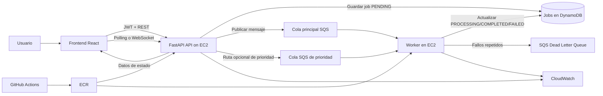

# Arquitectura del Sistema

Notas:
- La arquitectura prioriza simplicidad, bajo costo y facilidad de explicacion.
- La API y el worker estan contenerizados por separado, pero pueden ejecutarse en el mismo host EC2 durante el reto.
- El soporte de cola de prioridad queda reservado para el bonus B1.