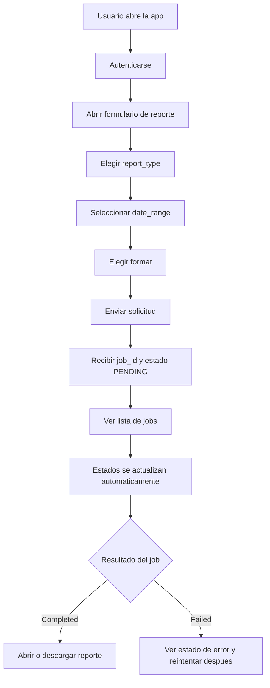

# Flujo de Usuario - Solicitud de Reporte

```mermaid
flowchart TD
    A[Usuario abre la app] --> B[Autenticarse]
    B --> C[Abrir formulario de reporte]
    C --> D[Elegir report_type]
    D --> E[Seleccionar date_range]
    E --> F[Elegir format]
    F --> G[Enviar solicitud]
    G --> H[Recibir job_id y estado PENDING]
    H --> I[Ver lista de jobs]
    I --> J[Estados se actualizan automaticamente]
    J --> K{Resultado del job}
    K -->|Completed| L[Abrir o descargar reporte]
    K -->|Failed| M[Ver estado de error y reintentar despues]
```

Notas:
- La UX debe mantenerse responsive en movil y desktop.
- Los estados de error deben ser visibles y no depender de dialogs nativos de alerta.