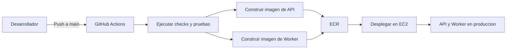

# Resumen de CI/CD

Notas:
- La ruta de despliegue es intencionalmente simple para reducir riesgo de entrega.
- El README final debe mostrar el badge de GitHub Actions y la URL publica de produccion.