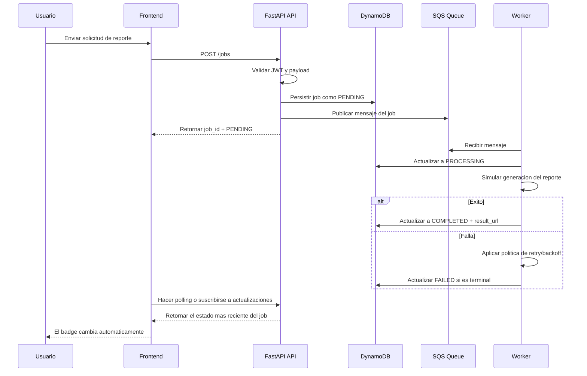

# Flujo de Ciclo de Vida del Job

```mermaid
sequenceDiagram
    participant User as Usuario
    participant Frontend as Frontend
    participant API as FastAPI API
    participant DDB as DynamoDB
    participant SQS as SQS Queue
    participant Worker

    User->>Frontend: Enviar solicitud de reporte
    Frontend->>API: POST /jobs
    API->>API: Validar JWT y payload
    API->>DDB: Persistir job como PENDING
    API->>SQS: Publicar mensaje del job
    API-->>Frontend: Retornar job_id + PENDING
    Worker->>SQS: Recibir mensaje
    Worker->>DDB: Actualizar a PROCESSING
    Worker->>Worker: Simular generacion del reporte
    alt Exito
        Worker->>DDB: Actualizar a COMPLETED + result_url
    else Falla
        Worker->>Worker: Aplicar politica de retry/backoff
        Worker->>DDB: Actualizar FAILED si es terminal
    end
    Frontend->>API: Hacer polling o suscribirse a actualizaciones
    API-->>Frontend: Retornar el estado mas reciente del job
    Frontend-->>User: El badge cambia automaticamente
```